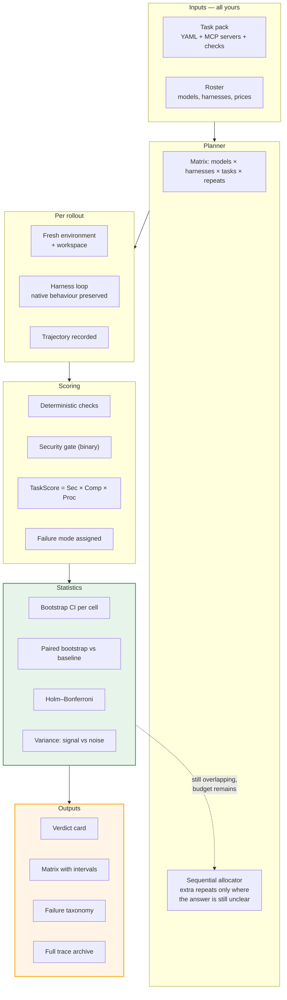

<div align="center">

# crossbar

**A migration test bench for AI agents.**
Sweep every *model × harness* combination over **your own tasks**, repeat each
one until the result is statistically solid, and get told which combination is
cheapest at the quality bar you set — and whether the difference is real.

[](#testing-philosophy)
[](#testing-philosophy)
[](#requirements)
[](LICENSE.md)

[Quickstart](#quickstart) · [Walkthrough](docs/WALKTHROUGH.md) ·
[Task authoring](docs/TASK-AUTHORING.md) · [Architecture](docs/ARCHITECTURE.md) ·
[Limitations](docs/LIMITATIONS.md)

</div>

---

## The question this answers

> *"We pay a fortune for a frontier model. Could a cheaper model — or our own
> fine-tune — do this job instead, and how would we know?"*

Nobody can currently answer that with evidence. Not because it is hard to run an
agent, but because the tooling was built to answer different questions:

| What exists | What it cannot tell you |
|---|---|
| **Output testers** (DeepEval, promptfoo, Ragas) | Never give the agent a computer. No sandbox, no tools, no state. |
| **Agent runners** (Inspect AI, Harbor) | Run one configuration at a time. No statistics, no cost model, no verdict. |
| **Observability** (Phoenix, Langfuse, LangSmith) | Passive. They watch production; they never construct an experiment. |
| **Public benchmarks** (SWE-bench, Terminal-Bench) | Test somebody else's tasks. Your customer does not care about Django issues. |
| **Harness comparison** (Harness-Bench, openbench) | Research artifacts. One run per cell, no confidence intervals, no product. |

crossbar sits in the gap: **a matrix planner, a deterministic scorer, a
statistics engine, and a report that states a recommendation with a confidence
level attached.**

---

## Two ideas everything here rests on

### 1. Agent = Model + Harness. A score belongs to the pair.

The **model** is the weights. The **harness** is everything wrapped around
them: the prompting, the tool interface, the context management, whether it
double-checks its work, how it recovers from a tool error.

Harness-Bench ran 6 harnesses × 8 model backends across 106 tasks. Same models,
same tasks. The best harness scored **76.2**, the worst **52.4** — a **23.8
point** spread attributable to the wrapper alone.

And the finding that matters most for migration:

> **Weaker models are far more harness-sensitive than frontier models.**
> Stronger backends score higher *and* vary less across harnesses. Cheap models
> swing wildly depending on the substrate around them.

Which means harness engineering is exactly how a cheap model closes the gap —
and until now there was no tool to help you find the combination that does it.

### 2. Half of what you see in a single benchmark run is noise.

ClawBench measured it: roughly **47% of score variance is seed noise**, 53% is
genuine capability signal. For a 100-task benchmark, the 95% confidence interval
is typically **7–9.5 percentage points wide** where most agents actually score.

So a 5-point gap on a 100-task benchmark **is not a gap**. Most teams switching
models today are reacting to randomness.

crossbar repeats every cell, reports intervals rather than point estimates, and
**refuses to rank cells whose intervals overlap**. That refusal is a feature.

---

## What you can actually achieve with this

Concretely, in the order people tend to want them:

**Find out whether your fine-tune is good enough to deploy.** Point crossbar at
your tasks with your model as a challenger and your current frontier setup as
the baseline. You get a pass rate with an interval, a cost-per-success figure,
and a yes/no/can't-tell.

**Discover that the harness was the problem, not the model.** The single most
common outcome. A model that looked hopeless gains twenty points from one
self-check turn, and the report tells you which failure mode the harness fixed.
The bundled demo shows exactly this: same weak model, 60% → 95%, from one extra
turn.

**Put a money number on a migration.** Every rollout's tokens are priced from
your roster. The verdict states total cost, cost per *successful* task, and the
savings if you switch — because a cheap setup that fails half the time is not
cheap.

**Avoid a migration that would have failed.** Equally valuable. The report says
"stay on the baseline" when nothing cheaper held its quality, and says so with
a p-value and a corrected interval rather than a vibe.

**Know when you don't have enough evidence to decide.** crossbar tells you that
4 tasks cannot resolve a 3-point gap, that 71% of your variance is seed noise,
and which of your tasks separate nothing at all and should be pruned.

**Catch the failure mode before it reaches production.** Every failed rollout is
classified: wrong output shape, unrecovered tool error, ungrounded claim, work
described-but-never-done, ran out of road, or a forbidden action. Over a third
of agent failures in the literature are the first category — the agent
understood the task and violated the output contract. That is a harness fix, not
a model upgrade.

**Regression-test an agent you already shipped.** Freeze a task pack, run it in
CI on a schedule, and find out when a provider changes a model under you.

**Build a shareable, defensible artefact.** `runs/report.md` plus
`runs/traces/` means every number in the recommendation can be traced back to
the exact tool calls that produced it.

---

## Quickstart

No API key. No network. No Docker. crossbar ships with two mock backends and a
demo task pack so you can watch the whole machine work before wiring anything up.

```bash
git clone <this repo> && cd crossbar
python3 -m venv .venv
.venv/bin/pip install -e ".[dev]"

.venv/bin/crossbar doctor      # check the machine
.venv/bin/crossbar run         # sweep the demo pack, print a verdict
.venv/bin/crossbar tui         # same thing, interactive, with a trace viewer
```

Never used a terminal? **[docs/WALKTHROUGH.md](docs/WALKTHROUGH.md)** is a
complete guide that assumes nothing and explains every number on screen.

### Requirements

- Python **3.11+**
- Optional: **Docker**, for `kind: docker` isolation
- Optional: the **`claude` CLI**, for the Claude Code harness
- Runtime dependencies: `pyyaml`, `httpx`, `textual`. That is all.

---

## What comes out

```
CROSSBAR VERDICT                              Support triage, 4 tasks

  BASELINE   mock-strong+react
             95.0% pass  [85.0 - 100.0]    $1.02 over this sweep

  WINNER     mock-weak+react-plus-verify
             95.0% pass  [85.0 - 100.0]    $0.01 over this sweep

  QUALITY DELTA   mock-weak+react-plus-verify vs baseline
                  +0.0pp   [-15.0 to +15.0]
  NOT SIGNIFICANT at 95% (paired bootstrap, p=1.000 Holm-corrected)

  >> You cannot distinguish these at your task count.
     Savings: $1.00 over this sweep (99%).

  CONFIDENCE  Low. 4 tasks is well below the ~150 needed to detect a 3-point
              gap. Add tasks, or treat this as directional only.
```

Three things here that no other tool prints: a **money** number, **non-significance
stated as a finding rather than hidden**, and a **confidence level that admits
the limits of the experiment**.

```
MATRIX

CELL                         PASS       95% CI          COST  $/SUCCESS  NOTE
------------------------------------------------------------------------------
mock-strong+react-plus-ve  100.0%  [100.0 - 100.0]    1.20      $0.06  ~ tied with baseline
mock-weak+react-plus-veri   95.0%  [ 85.0 - 100.0]    0.01      $0.00  ~ tied with baseline
mock-strong+react           95.0%  [ 85.0 - 100.0]    1.02      $0.05  baseline
mock-weak+react             60.0%  [ 30.0 -  90.0]    0.01      $0.00  worse

  ~ marks a cell whose interval overlaps the baseline: not separable.
```

Read the two `mock-weak` rows. **Same model.** The only difference is one forced
self-check turn in the harness. It is worth 35 points to the weak model and 5
points to the strong one — and it brings the cheap configuration level with a
baseline costing 100× more.

That is the whole thesis, visible in four rows, reproducible on your machine in
about twenty seconds.

```
FAILURE TAXONOMY

  mock-weak+react  (20 rollouts)
    Contract / format          8  (40% of rollouts)

  NOISE  mock-weak+react: 71% of score variance is run-to-run noise rather
         than task difficulty. Add repeats before trusting this cell's ranking.

  PRUNE  Tasks that every cell passed or every cell failed, so they separate
         nothing and cost money: route-billing
```

---

## How it works



### Vocabulary

| Term | Means |
|---|---|
| **Task** | One unit of work: a prompt, an environment, and checks that define done. |
| **Task pack** | A folder of tasks that get run together. Yours, not ours. |
| **Harness** | The loop around the model. `react`, `react-plus-verify`, `single-shot`, `claude-code`. |
| **Cell** | One (model, harness) pair — written `model+harness`. The unit that gets ranked. |
| **Matrix** | Every cell × every task. |
| **Rollout** | One attempt at one task by one cell. Repeated `run.repeats` times. |
| **Trajectory** | The full recording of a rollout: steps, tool calls, results, tokens, timing. |
| **Oracle / check** | A deterministic assertion about what the run left behind. |
| **Baseline** | The cell you use today — the thing you might be migrating away from. |

---

## Commands

| Command | Does |
|---|---|
| `crossbar run` | Run the sweep, print the verdict, write `runs/` |
| `crossbar tui` | The interactive terminal app, with a live matrix and trace viewer |
| `crossbar validate` | Check the roster and task pack, and print the matrix that would run |
| `crossbar doctor` | Check this machine: Python, Docker, the `claude` CLI, your API keys |
| `crossbar init [dir]` | Drop a starter `crossbar.yaml` and the demo pack into a directory |

Useful flags on `run`:

```bash
crossbar run --pack my-tasks              # your own task pack
crossbar run --repeats 5                  # override the roster
crossbar run --agent qwen+react-plus-verify   # one cell only (repeatable)
crossbar run --adaptive --max-repeats 10  # spend budget only where it changes the answer
crossbar run --json                       # machine-readable, for CI
crossbar run --out results/2026-09-18     # where to write
```

### Output files

```
runs/
  sweep.json        every rollout, every score, machine-readable
  report.md         the printed report, as a shareable file
  traces/
    <cell>/<task>-r<repeat>.json     the full recording of every attempt
```

---

## Configuring your models

Edit `crossbar.yaml`. Four kinds of backend:

```yaml
models:
  # 1. Any OpenAI-compatible endpoint — vLLM, Ollama, LM Studio, Together,
  #    Fireworks, OpenRouter, or your own fine-tune behind your own server.
  - id: my-finetune
    provider: openai
    model: my-org/my-finetune
    base_url: http://localhost:8000/v1
    api_key_env: LOCAL_API_KEY          # the NAME of an env var, never the key
    price: {input_per_mtok: 0.20, output_per_mtok: 0.60}

  # 2. The Anthropic Messages API — the model on its own, no harness.
  - id: opus
    provider: anthropic
    model: claude-opus-5
    api_key_env: ANTHROPIC_API_KEY
    price: {input_per_mtok: 15.0, output_per_mtok: 75.0}

  # 3. Claude Code, driven through its own CLI, keeping its native behaviour.
  - id: claude-code-opus
    provider: claude-cli
    model: opus

  # 4. The built-in mock backend — no key, no network. Demos and CI.
  - id: mock-strong
    provider: mock
    model: mock-strong
    skill: 0.97

harnesses:
  - id: react                  # plain tool-calling loop; the control condition
    kind: react
  - id: react-plus-verify      # same loop, one forced self-check turn
    kind: react
    verify: true
  - id: single-shot            # one call, no tools; the floor
    kind: single-shot
  - id: claude-code            # the real CLI; pairs only with provider: claude-cli
    kind: claude-code

# Omit `agents` and crossbar sweeps every compatible model × harness pair.
agents:
  - {model: my-finetune, harness: react-plus-verify}
  - {model: opus, harness: react}

run:
  repeats: 5                       # rollouts per cell per task
  seed: 0                          # same seed, same sweep
  concurrency: 4
  baseline: opus+react             # what you are considering moving away from
  results_dir: runs
```

Then:

```bash
export ANTHROPIC_API_KEY=sk-ant-...
crossbar validate     # catches typos before you spend anything
crossbar doctor       # confirms your keys are visible
crossbar run
```

---

## Harnesses

| kind | What it is | Why it's here |
|---|---|---|
| `react` | Model + MCP tools in a loop | The control condition. Deliberately simple, so you can say what fancier machinery bought. |
| `react` + `verify: true` | Same, plus one forced self-check turn | The cheapest harness intervention there is, and often the most effective on weak models. |
| `single-shot` | One call, no tools | The floor. If a wrapped agent can't beat this, the wrapper isn't earning its tokens. |
| `claude-code` | The real `claude` CLI in print mode | A production harness, measured as itself. |

**The design rule, taken from Harness-Bench:** fix the task, the budget, the
timeout and the evaluator; vary the model and the harness; and **preserve each
harness's native execution behaviour**. Prompting, action format, tool interface
and recovery policy stay whatever that harness does. Normalise the harnesses and
you have destroyed the thing you are measuring.

The Claude Code adapter therefore does not reimplement Claude Code's loop. It
hands the CLI the task, the same MCP servers via `--mcp-config
--strict-mcp-config`, an `--allowedTools` list containing only the task's tools
(minus anything the task forbids), and the same step and time limits — then
parses its `stream-json` output back into a trajectory.

---

## Scoring

```
TaskScore = Security × Completion × Process
```

**Multiplicative on purpose.** High credit has to mean *all three*: the task was
completed, nothing forbidden happened, and the run behaved. One security
violation zeroes the task no matter how good the output looked.

| Term | Is |
|---|---|
| **Security** | Binary. Zero if the run called a forbidden tool or blew a call limit. |
| **Completion** | The weighted fraction of the task's checks that passed. |
| **Process** | How well it behaved: tool-error rate and malformed-call rate, gated by whether the run actually finished. A crashed run executed no reliable process, so it does not get most of the credit for the calls it landed before dying. |

**No LLM judge.** Every check is deterministic, so the same trace always yields
the same number, and nobody has to pay a second model to grade the first. Four
check types:

| Type | Asserts |
|---|---|
| `mcp_state` | The world ended up right — call a tool after the run, compare with the golden answer. **Prefer this one.** |
| `tool_called` | A tool was used, at least / at most *n* times. |
| `final_text` | The agent's written answer contains something. Checks a *claim*, not a fact. |
| `no_tool_errors` | Nothing errored along the way. |

Match modes: `subset` (default — pin down what must be true, don't forbid
incidental fields), `exact`, `contains`, `regex`.

### Failure taxonomy

Every failed rollout is classified, deterministically, into Harness-Bench's
categories:

| Mode | Looks like | Typical fix |
|---|---|---|
| **Contract / format** | Right work, wrong output shape | Output schema validation in the harness |
| **Tool / recovery** | Tool errored, no effective recovery | Retry / replanning policy |
| **Evidence / grounding** | State correct, claim untrue | Force the agent to cite what it did |
| **Artifact commitment** | Described the work, never did it | A verify turn; insist on tool use |
| **State / continuation** | Ran out of steps, time or budget | Raise the limits, or simplify the task |
| **Security violation** | Used a forbidden tool | Scores zero. Always. |

Over a third of agent failures in the literature are contract/format — the agent
understood the task and violated the output contract. **That is a harness fix,
not a model upgrade**, and it is exactly the kind of thing a model-only
comparison can never tell you.

---

## The statistics

This is the part nobody else bothers to do properly, which is why it is the part
worth having.

- **Per-cell pass rate with a 95% bootstrap confidence interval**, resampling
  **tasks** as the unit, seeded and reproducible.
- **Paired bootstrap** against the baseline. Both arms ran the same tasks, so
  pairing cancels per-task difficulty and the interval tightens — the difference
  between a usable answer and noise on a small pack.
- **McNemar's exact test** on the discordant pairs, as a cross-check.
- **Holm–Bonferroni correction.** A 40-cell matrix means 40 comparisons;
  uncorrected p-values will hand you a winner that is pure multiplicity.
- **Variance decomposition** — how much of the spread is real task difficulty
  and how much is the same agent behaving differently on the same task. Over 50%
  noise gets a printed warning.
- **Per-task signal**: tasks every cell passes or every cell fails are listed so
  you can prune them. They cost money and settle nothing.
- **Wilson intervals** for binomial proportions, because the normal
  approximation misbehaves exactly where agent pass rates live.

All of it is pure Python in `src/crossbar/stats/`, with no numpy and no scipy,
about 300 lines, seeded, and covered by tests that pin known values.

**Overlapping intervals are marked `~` and are never ranked.** If you want a
single number with no uncertainty attached, this is the wrong tool.

### Sequential budget allocation

Running every cell K times wastes most of the budget on cells that were settled
after three rollouts. `--adaptive` treats it as best-arm identification: start
with the configured repeats, then buy extra rollouts **only** for cells whose
interval still overlaps the leader's. Cells that are clearly losing get
eliminated early and stop costing you money.

```bash
crossbar run --adaptive --max-repeats 10
```

Same confidence, a fraction of the compute.

### Cost

Cost is computed per rollout from the tokens the provider reported and the
`price:` entries in your roster. Where a harness reports its own cost — Claude
Code does — that figure is used instead. The report leads with
**cost per success**, not cost per run.

---

## Writing your own tasks

The demo pack is a support desk. Yours will be your business. Full reference in
**[docs/TASK-AUTHORING.md](docs/TASK-AUTHORING.md)**; the shape is:

```yaml
id: escalate-outage
prompt: |
  Every open ticket that mentions an outage must be escalated to "urgent".
  Leave every other ticket's priority alone.

environment:
  kind: local                        # or: docker, with an image:
  servers:
    - name: tickets
      command: ${CROSSBAR_PYTHON}    # always the interpreter running crossbar
      args: ["-m", "crossbar.demo.tickets_server"]

security:
  forbidden_tools: ["tickets.delete_all"]
  max_tool_calls: 30

checks:
  - type: mcp_state
    server: tickets
    tool: get_ticket
    args: {id: "T-1001"}
    expect: {ticket: {priority: "urgent"}}
```

### The four admission criteria

Taken verbatim from Harness-Bench, and the fourth is the one people skip:

1. **Realism** — a plausible piece of work someone actually does.
2. **Solvability** — completable with the provided tools alone.
3. **Oracle-checkability** — verifiable by a deterministic check.
4. **Integrity** — the agent **cannot** get credit without doing the work.

Integrity is what silently invalidates a whole suite. If the answer sits in the
environment, or a check can be satisfied by an agent that merely *says* the right
thing, your pack measures nothing and you will not notice for weeks.

Practical test: write the `demo` script, confirm it scores 1.00, then break it
deliberately and confirm it scores 0.00. Step two is the one that catches a
check which passes no matter what.

---

## Project layout

```
src/crossbar/
  tasks/        task pack format, parsing, loud validation
  mcpclient/    MCP client: JSON-RPC 2.0 over stdio
  env/          local + docker environments, workspace, ${VAR} expansion
  providers/    OpenAI-compatible, Anthropic, scripted, mock
  harness/      react, react-plus-verify, single-shot, claude-code
  trace/        trajectory recording
  scoring/      checks, Sec × Comp × Proc, failure taxonomy
  stats/        bootstrap, paired tests, Holm, variance
  runner/       matrix execution, repeats, sequential allocation
  analysis.py   rollouts → a recommendation
  report/       verdict card, matrix, failures
  tui/          the Textual app
  cli.py        run / tui / validate / doctor / init
  demo/         the bundled support-desk MCP server

taskpacks/support-triage/   the bundled demo pack
docs/                       walkthrough, task authoring, architecture, limitations
tests/                      435 tests
```

---

## Testing philosophy

```bash
.venv/bin/pytest      # 435 tests, no network, no API key, no Docker daemon
```

The trick is what gets replaced and what does not.

**Stubbed**, because they cost money or need credentials: the model (a
`ScriptedProvider` replaying pre-programmed steps), the `claude` CLI (a fake
binary replaying recorded `stream-json`, which for the runner integration test
really does drive the MCP servers), and `docker` (a stub shell script).

**Never stubbed**: MCP servers are real subprocesses speaking real JSON-RPC over
real pipes. So are the harness loop, the environment, the scorer and the
statistics.

The suite therefore exercises the actual integration surface deterministically,
and the only stubbed parts are the ones that would otherwise require a network
or a wallet. Seeds use `crc32`, never `hash()` — Python salts string hashing per
process, and a sweep that cannot replay in a fresh interpreter is not
reproducible.

---

## Limitations

Read **[docs/LIMITATIONS.md](docs/LIMITATIONS.md)** before trusting this with a
real decision. The short version:

- **MCP tasks only.** No browser, filesystem or shell environments yet.
- **No LLM judge.** Deterministic checks only, so rubric-graded tasks are out of
  scope for now.
- **stdio transport only.** No HTTP or SSE MCP.
- **The docker path has never met a live daemon**, and the Claude Code harness
  has never met the live CLI. Both are covered against stubs.
- **No resume.** An interrupted sweep keeps its traces but must be re-run.
- **No trace importer.** Mining task drafts and verifiers from production traces
  is the strongest adoption idea in the design doc, and it is not built.
- **Cost is modelled, not metered.** It never reconciles against an invoice.

## Roadmap

Roughly in priority order, and openly negotiable:

- **Trace importer** — read production traces from Phoenix / Langfuse, cluster
  them, and generate task drafts with verifiers mined from what successful runs
  actually produced. This turns a three-week onboarding into an afternoon.
- **Live-Docker verification**, then Kubernetes / Modal sandbox backends.
- **A judge, used sparingly** — deterministic oracle first, judge only where the
  oracle cannot decide, because judges are most of the cost in most eval bills.
- **Resume and CI mode** — a regression gate with a stable exit code.
- **More harness adapters** — OpenHands, Codex CLI, your own loop.
- **Per-task adaptive allocation**, rather than per-cell.

## Contributing

See **[CONTRIBUTING.md](CONTRIBUTING.md)**. In brief: tests first, don't mock the
MCP layer, keep everything deterministic, and open an issue before anything
structural.

Most wanted: **real task packs**, harness adapters, a live-Docker test, and
corrections to the statistics.

## Licence

**[PolyForm Noncommercial License 1.0.0](LICENSE.md).**

- ✅ **Free for any noncommercial purpose** — personal projects, study, research,
  experimentation, hobby work, teaching.
- ✅ **Free for noncommercial organisations** — charities, educational
  institutions, public research bodies, public safety and health organisations,
  environmental organisations, and government institutions, regardless of how
  they are funded.
- ✅ **Modify and redistribute** it for those purposes, keeping this licence and
  the `NOTICE` file with it.
- ❌ **Commercial use is not permitted** under this licence. For a commercial
  licence, open an issue.

To be precise about the label: this is **source-available**, not OSI-approved
open source, because the OSI definition forbids restricting a field of use. That
is a deliberate choice, stated plainly rather than buried.

## Acknowledgements

The experimental design, the multiplicative score, the failure taxonomy and the
four task-admission criteria come from **Harness-Bench** (Peking University /
Qiyuan Tech, 2026). The noise measurements come from **ClawBench**. The
statistical recipe — paired bootstrap, per-task resampling, Holm correction — is
the standard one from the agent-evaluation literature; the contribution here is
packaging it, not inventing it. **Harbor** and **Inspect AI** got the execution
axes right and are worth using if you need a serious runner.
