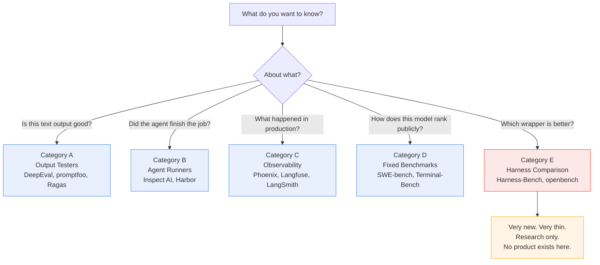
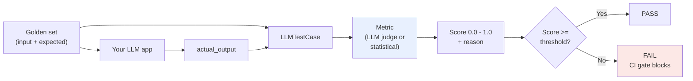
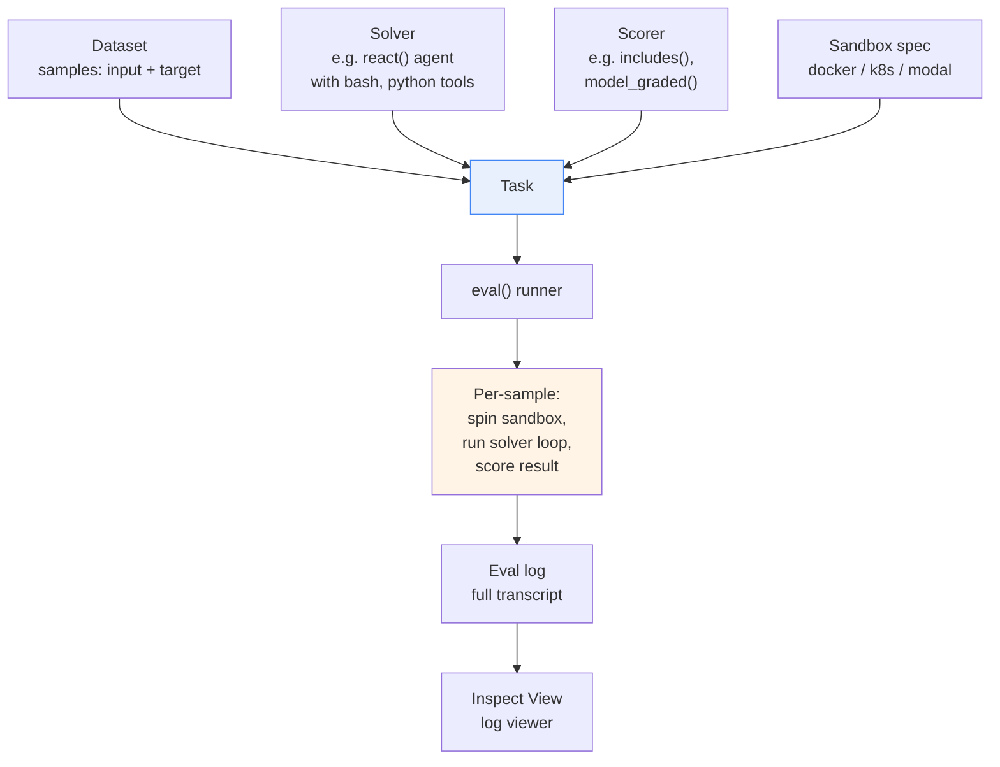
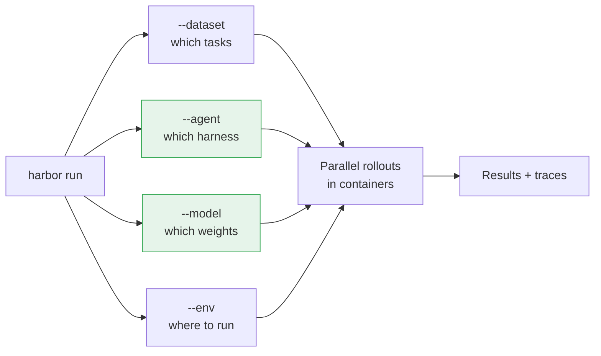
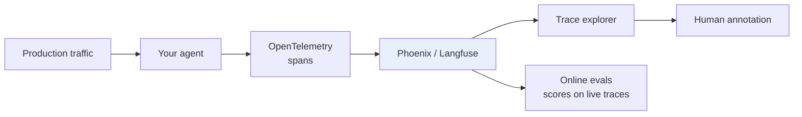
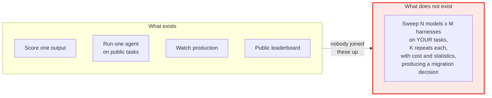
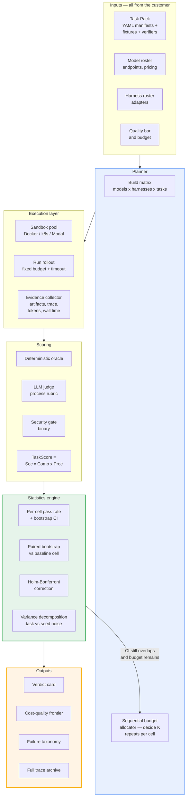
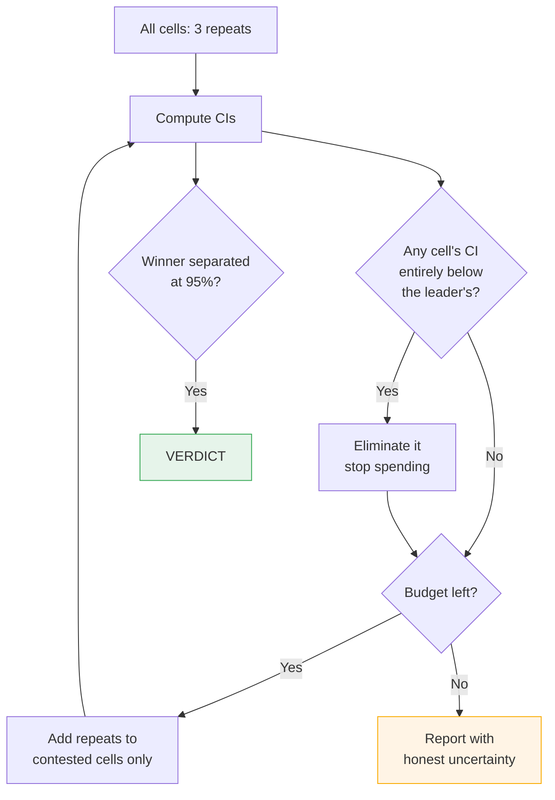
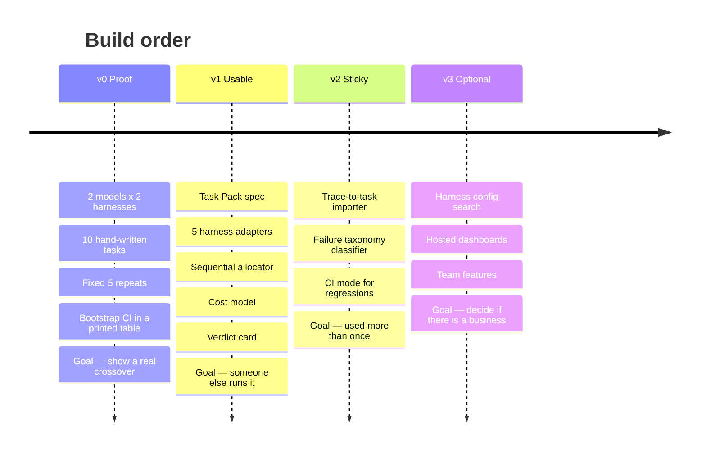

# Agent + Harness Evaluation: What Exists, and What We Could Build

**Audience:** product owner (you)
**Purpose:** understand the current tooling landscape in plain language, then decide what to build
**Date:** September 2026

---

## 0. Vocabulary (so the rest of the doc is unambiguous)

These words get used loosely in the industry. Here is how this document uses them.

| Term | Meaning |
|---|---|
| **Model** | The raw weights. GPT-5.4, Claude Opus 4.6, Qwen3.6, your fine-tuned Llama. |
| **Harness** | Everything wrapped around the model that turns its text output into real actions. Prompt templates, tool definitions, context management, retry logic, permissions, state handling, recovery. Claude Code, Codex CLI, OpenHands, and your own custom loop are all harnesses. |
| **Agent** | Model + Harness. The thing that actually does work. |
| **Task** | One unit of work with a starting state and a definition of done. |
| **Environment / Sandbox** | The isolated box the task runs inside. Usually a Docker container or microVM. |
| **Oracle / Verifier** | The deterministic check that says whether the task was done correctly. A test suite, a file diff, a JSON schema check. |
| **Judge** | An LLM that scores something an oracle cannot check deterministically, like writing quality. |
| **Trajectory / Trace / Rollout** | The full recording of one attempt: every model call, every tool call, every file change, tokens used, time taken. |
| **Golden set** | Your curated collection of tasks with known-good answers. |

The single most important idea in this whole space, and the one the industry has only recently accepted:

> **Agent = Model + Harness.** A score belongs to the pair, not to the model.

Harness-Bench (Peking University / Qiyuan Tech, May 2026) demonstrated this at scale. Running 6 harnesses against 8 model backends across 106 tasks produced 5,088 trajectories, and the best-scoring configurable harness reached 76.2 while the worst reached 52.4 on the same task set and the same pool of model backends, a 23.8 point gap. Same models. Different wrapper. Twenty-four points.

That gap is the entire business case for what you want to build.

---

## 1. The Current Landscape

There are five distinct categories of tool. They are frequently confused with each other, including by the vendors. Understanding which category a tool belongs to tells you immediately what it cannot do.



---

### Category A: Output Testers

**Examples:** DeepEval, promptfoo, Ragas, TruLens

**What they do in one sentence:** Take a piece of text the model produced, score it against criteria, pass or fail.

**How DeepEval works.** It is an open-source framework from Confident AI, released August 2023 under Apache 2.0, with over fifty research-backed metrics. It adopts a unit-testing style borrowed from pytest, so evaluation cases are written in Python and dropped into CI/CD pipelines.

The architecture rests on three ideas: test cases, metrics, and evaluation runs. A test case holds one interaction — the input prompt, the actual output, and optional extras like expected output, retrieval context for RAG, or conversation history for multi-turn. Metrics are scoring functions that take a test case and return a number between zero and one plus a readable explanation.

Most metrics work by LLM-as-a-judge: a second model reads the input, the output, and any context, grades it against a rubric, and returns a score plus a written reason. You set a threshold per metric and the test passes only when the score clears it. You also pick the judge model, which controls both cost and strictness.



**Where it runs:** Locally. DeepEval is local-first — evaluations run in your own environment. Good for your self-hosted requirement.

**What it recently added:** Agent, tool-use, and trajectory-based evaluation, plus component-level evals where metrics attach to individual spans rather than the whole run. So it is moving toward agents.

**What it still does NOT do:**
- Does not give the agent a computer. There is no sandbox, no container, no file system for the agent to act in.
- Does not run a matrix. You compare one config at a time.
- Does not measure cost or latency as first-class outputs.
- No statistical machinery. It gives you a score, not a confidence interval.

**promptfoo** is the closest thing to a matrix tool in this category. It suits teams wanting a local CLI, a model matrix, security tests, and simple CI quality gates. But its matrix is over prompts and models, not over harnesses, and it does not execute agents in environments.

---

### Category B: Agent Runners

**Examples:** Inspect AI (UK AI Security Institute), Harbor (Laude Institute / Terminal-Bench creators)

These are the serious ones. They give agents real computers.

**How Inspect AI works.** It is an open-source Python framework from the UK AI Security Institute for reproducible LLM evaluations. The primitives are dataset, Task, Solver, Scorer. It handles multi-turn agent workflows with tools, sandboxed execution with Docker built in, and optional Kubernetes or Proxmox adapters, plus a log viewer.

The three core concepts are the Dataset (your test cases, each with an input and a target), the Solver, and the Scorer. It sits over a model layer covering OpenAI, Anthropic, Google, Groq, Mistral, xAI, Bedrock, Azure, Together, and local vLLM, Ollama, and llama-cpp. Agents include a built-in ReAct loop, multi-agent composition, and a bridge to external frameworks. Tools include bash, python, text editing, web search, browser, and computer use, plus MCP.

A key design principle is composition — custom solvers and scorers can be packaged as ordinary Python packages and reused across evaluations.



The sandboxing system supports Docker, Kubernetes, Modal, Proxmox, Vagrant, and others through an extension API. AISI's sandboxing protocol classifies isolation on three axes: tooling (what the model can execute), host (stopping escape or host compromise), and network (controlling access to external systems). That three-axis model is worth stealing outright.

**How Harbor works.** Harbor comes from the creators of Terminal-Bench. It evaluates arbitrary agents like Claude Code, OpenHands, and Codex CLI, lets you build and share your own benchmarks and environments, runs experiments in thousands of environments in parallel through providers like Daytona, Modal, LangSmith, Blaxel, and Novita Sandbox, and generates rollouts for RL optimization.

The interface is refreshingly blunt:

`harbor run --dataset terminal-bench@2.0 --agent claude-code --model anthropic/claude-opus-4-1 --n-concurrent 4` launches the benchmark locally using Docker. Adding `--env daytona` moves it to a cloud provider.

Notice the shape of that command. Dataset, agent, model, three separate flags. **Harbor already has the right axes.** It is the closest existing thing to what you want.



**What Category B does NOT do:**
- No opinion about statistics. You get pass rates, not confidence intervals. Running the same cell three times and getting 2/3, then 1/3, then 3/3 is your problem to interpret.
- No cost modelling. Tokens are recorded but nobody converts them to rupees or dollars per task at your provider's pricing.
- No decision output. It gives you a table. It does not tell you whether to switch.
- Task authoring is manual and technical. You write Docker images and verifier scripts by hand.
- The default mental model is one config at a time, not a sweep.

---

### Category C: Observability Platforms

**Examples:** Arize Phoenix, Langfuse, LangSmith, Braintrust, W&B Weave, Comet Opik

**What they do:** Record what happened in production. Traces, spans, sessions. Let you attach scores to them after the fact.

The distinction DeepEval draws is clean: observability tools help you inspect what happened; evaluation frameworks tell you whether behaviour is good enough.

Phoenix is OpenTelemetry-native, self-hostable tracing and evaluation, though its managed features and tighter eval integration push you toward Arize AX. Langfuse is open-source and self-hostable with a managed cloud option, but self-hosting adds infrastructure overhead and its eval depth is limited compared to full platforms.

Braintrust is not fully open source — its AI proxy is open source, but the main eval platform, product UI, and Brainstore backend are proprietary. Relevant if you care about building something genuinely open.



**Why this matters to you:** Not as a competitor. As a **data source**. This is where the customer's real task material already lives.

**What they do NOT do:** They are passive. They watch. They never construct a controlled experiment.

---

### Category D: Fixed Benchmarks

**Examples:** SWE-bench, Terminal-Bench 2.0, WebArena, OSWorld, GAIA, AgentBench, ClawBench, ClawMark

**What they do:** A frozen set of tasks everybody runs so numbers are comparable across papers and leaderboards.

**What they do NOT do, and this is the fatal one for enterprise use:** They test somebody else's work. Existing benchmarks either abstract away execution, evaluate a complete submitted agent stack, or hold the execution setup fixed to compare models.

Your customer does not care whether a model can fix Django issues. They care whether it can process their insurance claims.

Also: leaderboards get contaminated and gamed. A public benchmark score has weak predictive power for private workloads.

---

### Category E: Harness Comparison (the new, thin category)

This is where your idea lives. Three things exist here, and all three are research artifacts rather than products.

**Harness-Bench (May 2026).** The most rigorous. It fixes the task environment, budget, timeout, and evaluator while preserving each harness's native execution behaviour, rather than forcing all systems into an identical internal implementation.

Their controlled-vs-varied table is the correct experimental design and you should copy it:

| Factor | Treatment |
|---|---|
| Task prompt and fixtures | **Fixed** |
| Initial sandbox state | **Fixed** |
| Budget, timeout, evaluator | **Fixed** |
| Model backend | **Varied** |
| Harness configuration | **Varied** |
| Prompting and action format | Native to each harness |
| Tool interface and state policy | Native to each harness |
| Retry and recovery behaviour | Native to each harness |

Their scoring is also smart. TaskScore = Security × Completion × Process, where Security is binary (zero if the run violates permission constraints, exposes secrets, or takes forbidden actions) and Process is the average of Robustness, Tool Use, and Consistency. The multiplicative form is deliberately conservative: high credit requires completion, no security violation, and reliable execution behaviour.

Multiplicative, not additive. One security violation zeroes the whole task. That is the right default for anything enterprise-facing.

Their failure taxonomy is the most immediately useful thing in the paper:

| Failure mode | Rate among failures | What it looks like |
|---|---|---|
| Contract / format | 36.4% | Malformed JSON, missing rows, incomplete manifests |
| Tool / recovery | 24.6% | Tool errors with no effective recovery or replanning |
| Evidence / grounding | 14.6% | Unsupported claims, incomplete source coverage |
| Artifact commitment | 11.1% | Plausible reasoning, required output never written |
| State / continuation | 9.3% | Progress not preserved across interruption or rounds |

Over a third of all failures happen at the boundary between semantic plausibility and machine-checkable output. The agent appears to understand the task but violates an output schema or fails to produce a consumable artifact.

The finding most relevant to your migration thesis: stronger model backends achieve higher mean scores while showing lower cross-harness variance. Weaker or less robust backends show larger variance across harnesses, meaning their performance is more sensitive to the surrounding execution substrate.

Read that again, because it is your product's reason to exist.

**Cheap open models are more harness-sensitive than expensive frontier models.** Which means: harness engineering is exactly how a cheap model closes the gap, and there is currently no tool that helps a company find the right combination.

Fireworks and Harvey demonstrated the payoff empirically. On Harvey's Legal Agent Benchmark, an open-source GLM 5.1 worker that self-triggers Claude Opus 4.7 as a callable advisor on selected sub-tasks reached 18/100 all-pass at $368, versus 14/100 for Opus end-to-end at $954. Supervised fine-tuning of Kimi K2.6 on the same benchmark's trajectories reached 15/100 at $84.

Better results. A third of the cost. And in the fine-tuned case, roughly a tenth. That is the outcome your product helps a company find.

**Harness-Bench's own stated limitations** (these are your openings):
It focuses on controlled, sandboxed offline workflows, improving reproducibility at the cost of coverage of live services, changing external state, and long-term production memory. Cross-harness variance is computed over harness-level averages rather than repeated stochastic runs.

That last clause is significant. **They did not do repeated runs.** They ran each cell once. So even the best research in this category has no handle on run-to-run noise.

**The other two artifacts:**
- **openbench** — a from-scratch comparison of coding-agent harnesses and open models on correctness, speed, and token cost. A hobby project, not a framework.
- **Hugging Face `agent-eval`** — measures not just whether a task completed but how much effort it took in turns, tokens, time, and errors. Its finding: a new CLI and Skill commit helped large open models complete tasks faster but hurt smaller models, with Qwen3-14B collapsing to 0% accuracy on tasks it previously aced because it misinterpreted the Skill documentation as a callable tool.

That example is perfect marketing material. The same harness improvement that helped the big model **destroyed** the small one. Nobody would have predicted it. You can only find it by sweeping.

---

## 2. The Gap, Stated Precisely



Concretely, six things are missing. No existing tool has more than two of them.

1. **The matrix is not first class.** Every tool runs one configuration. You loop by hand.
2. **Statistics are absent.** Agent runs are wildly stochastic and nearly everybody reports single-run numbers.
3. **Cost is not a first-class metric.** Tokens get logged. Nobody computes total cost of ownership per successful task.
4. **Your tasks are hard to get in.** Authoring a sandboxed task with a deterministic verifier is a day of work per task.
5. **There is no verdict.** Tools emit tables. Decisions need a recommendation with a stated confidence.
6. **Nothing is framed around migration.** The entire category is framed as quality assurance, not as "can I stop paying for the frontier model."

On point 2, the research consensus is clear and the tooling has simply not caught up:

Many benchmarks report results from a single run per agent, without confidence intervals, standard errors, or replication. Some report average@k with k=3, but still without confidence intervals or significance measures. Comparisons between agents are frequently made without statistical testing, so observed differences may partly reflect random variation rather than genuine capability differences.

How bad is the noise? ClawBench found 47% of score variance is seed noise and 52.7% is genuine capability signal.

**Roughly half of what you see when you run an agent benchmark once is random.**

And the sample sizes people use are far too small to see through it. For a single benchmark with n=100 binary trials, the 95% Wilson confidence interval half-width typically runs from 7 to 9.5 percentage points when the success rate sits between 0.3 and 0.8, which is exactly where most leading agent configurations land.

So a 5-point difference on a 100-task benchmark is **not a difference**. Most teams switching models today are acting on noise.

The methods to fix this are well established and nobody has packaged them:

When comparing two agents on the same evaluation items, predictions are paired, so methods that exploit the pairing are preferable. McNemar's test applies, or paired bootstrap methods that resample items with replacement to build confidence intervals for the difference in accuracy. Performance varies from two distinct sources: between-task variance, where some tasks are simply harder, and within-task variance, where the agent behaves inconsistently on the same task across trials. Five or more trials substantially stabilises estimates.

The standard recipe in current papers: 95% bootstrap percentile intervals with 10,000 resamples over tasks as the primary unit, per-task Pass@k from the unbiased combinatorial estimator, paired bootstrap tests for pairwise significance, and Holm-Bonferroni correction for multiple comparisons.

That is the statistical core of your product, spelled out. It is maybe 300 lines of Python. It is also the part nobody else will bother to do properly, which is precisely why it is defensible.

---

## 3. What We Build

### 3.1 The one-line pitch

> **An open-source migration test bench. Point it at your tasks. It sweeps every model and harness combination in parallel sandboxes, repeats each one until the result is statistically solid, and tells you which combination is cheapest at the quality bar you set — and whether you can trust the difference.**

Not "an eval framework." The world has enough eval frameworks. This is a **decision engine for a specific, expensive, currently-unanswerable question.**

### 3.2 Working name

`crossbar` — the bar you put across two things to compare them. Also suggests a matrix.

(Alternatives: `swapcost`, `defect` as in defecting from a vendor, `parity`.)

### 3.3 Architecture



The green box and the orange box are the product. Everything else can be borrowed, and should be.

### 3.4 The six components

**(1) Task Pack format**

A directory with a manifest. Steal Harness-Bench's four admission criteria verbatim: Realism (a plausible user workflow), Solvability (completable with the provided sandbox resources), Oracle-checkability (success verifiable by deterministic check or specified rubric), and Integrity (agents cannot get credit by reading hidden answers, modifying protected fixtures, or bypassing constraints).

Integrity is the one people forget and it is the one that silently invalidates a whole eval suite.

```yaml
id: claims-triage-003
category: vertical-workflow
timeout_s: 900
budget_tokens: 150000
fixtures:
  - in/claims.csv
  - in/policy.pdf
protected:           # agent may read, never write
  - in/policy.pdf
expects:
  - out/decisions.json
  - out/escalations.csv
verifier:
  type: script       # deterministic first
  path: verify.py
rubric:              # judge only for what scripts can't check
  - tone_professional
security:
  forbid_network: true
  forbid_paths: ["/etc", "in/"]
```

**(2) Harness adapters**

The thin layer that makes any wrapper runnable. Three methods: `setup(workspace)`, `run(prompt, budget)`, `collect_trace()`.

The critical design rule, straight from Harness-Bench: preserve each harness's native execution behaviour rather than forcing all systems into a common internal policy or runtime. Fix the task, budget, timeout, and evaluator. Let the harness be itself. If you normalise the harnesses you have destroyed the thing you are measuring.

Ship with adapters for Claude Code, Codex CLI, OpenHands, a bare ReAct loop, and a plain single-shot baseline. The bare ReAct loop is important as a control condition.

**(3) Matrix planner with sequential budget allocation**

This is the first genuinely novel piece.

Naive approach: run every cell K times. With 8 models × 5 harnesses × 100 tasks × 5 repeats that is 20,000 rollouts and a very large bill.

Better approach: treat it as a best-arm identification problem. Start with 3 repeats on every cell. Then spend the remaining budget only where it changes the answer — cells whose confidence intervals still overlap the current leader. Cells that are clearly losing get eliminated early and stop consuming budget.



This is your headline efficiency claim: **the same confidence for a fraction of the compute.**

**(4) Three-layer scorer**

Copy the multiplicative structure. `TaskScore = Security × Completion × Process`, security binary.

Order matters for cost: run the deterministic oracle first, and only invoke the LLM judge when the oracle cannot decide. Judges are the expensive part of most eval bills.

One warning from the field on judge selection: Red Hat's eval-driven-development work found that evaluator model capability matters significantly, with llama-3-3-70b catching all known failures while smaller models missed four to five cases. Do not cheap out on the judge. Do cheap out on how often you call it.

**(5) Statistics engine**

The differentiator. Concretely:

- Per-cell pass rate with 95% bootstrap CI, 10,000 resamples, tasks as the resampling unit, fixed seed for reproducibility
- Paired bootstrap against the baseline cell, since the same tasks run in both
- McNemar's test on binary outcomes as a cross-check
- Holm-Bonferroni correction, because a 40-cell matrix means 40 comparisons and uncorrected p-values will lie to you
- Variance decomposition reporting what share of variance is seed noise versus capability signal
- Per-task signal-to-noise, flagging tasks that discriminate nothing so the customer can prune them

The guidance to bake into the UI: report bootstrap confidence intervals as a standard column in every results table, because a result with overlapping CIs is not a statistically meaningful difference regardless of how large the point-estimate gap looks.

Make overlapping CIs visually impossible to ignore. Grey out the cell. Refuse to rank it.

**(6) Verdict card**

The output a CTO reads. One screen.

```
CROSSBAR VERDICT                  claims-triage pack, 84 tasks

  BASELINE   claude-opus-4.6 + native
             91.2% pass  [88.1 - 93.8]    $1,840/mo at current volume

  WINNER     qwen3.6-plus + react-plus-verify
             88.7% pass  [85.2 - 91.6]    $203/mo

  QUALITY DELTA   -2.5pp   [-6.1 to +1.2]
  NOT SIGNIFICANT at 95% (paired bootstrap, p=0.21, Holm-corrected)

  >> You cannot distinguish these at your task count.
     Savings: $1,637/mo (89%).

  CONFIDENCE  Medium. 84 tasks is below the 150 needed to
              detect a 3pp gap. Add tasks or accept the risk.

  WATCH OUT   Contract/format failures 3.1x baseline rate.
              Add output-schema validation to the harness.
              Est. recovery: +2pp. See failures/contract.md
```

Note the three things this does that no existing tool does: it states a **money** number, it states **non-significance** as a positive finding, and it **prescribes a harness fix** derived from the failure taxonomy.

### 3.5 What we deliberately do NOT build

Ruthlessness here decides whether this ships.

| Not building | Why | Use instead |
|---|---|---|
| Sandbox infrastructure | Solved, hard, boring | Harbor / Inspect sandbox layer |
| Tracing and span storage | Very solved | OpenTelemetry, Phoenix |
| Metric library | 50+ already exist | DeepEval as a library |
| A hosted service | Not your model, and kills enterprise adoption | Self-host only |
| A public leaderboard | Contradicts the private-tasks thesis | — |
| Task authoring UI | Premature | YAML and a CLI |

The honest framing: **you are building a planner, a statistics engine, and a report, sitting on top of Harbor.** That is a weekend-scale prototype and a months-scale product. Resist the urge to rebuild the runner.

### 3.6 Roadmap



**v0 exists to answer one question:** can you produce a real, reproducible case where a cheap open model plus a good harness beats an expensive model plus a mediocre harness on a private task set, with a confidence interval attached?

If yes, that single result is the entire launch post. It writes itself.

### 3.7 The thing that makes people actually use it

Point 4 from the gap list — getting tasks in — is what kills adoption. Twenty hand-authored sandboxed tasks is weeks of work, and every team stalls there.

Your answer: **the trace importer.** The customer already has thousands of real agent runs sitting in Phoenix or Langfuse or a log bucket. Read those traces, cluster them, and propose task drafts with the initial state reconstructed and a verifier skeleton generated from what the successful runs actually produced.

You are right that generating tasks is easy. The hard part, as you identified, is the verifier. So invert it: **mine verifiers from observed successful outcomes rather than generating them from scratch.** If forty production runs all ended with a JSON file matching a particular shape, that shape is your schema check. No LLM guessing required.

This turns a three-week onboarding into an afternoon, and it is defensible in a way the rest of the stack is not.

### 3.8 Honest risks

| Risk | Severity | Mitigation |
|---|---|---|
| Harbor adds a matrix mode and statistics | **High** | Move fast, or contribute the stats layer upstream and own it there |
| Compute cost makes people avoid running it | High | The sequential allocator IS the mitigation, so lead with it |
| Verifier quality is the real bottleneck | High | Trace mining; ship a verifier library for common shapes |
| Harness adapters rot constantly | Medium | Keep adapters in a separate repo with community ownership |
| Nobody is migrating as much as we assume | Medium | Validate before v1 — talk to five teams |
| Open source with no business model | Medium | Fine for now. Optional paid layer later is hosted runs and org dashboards, never the core |

On the first risk: Harbor is backed by the Laude Institute and moving quickly. Contributing your statistics layer upstream may genuinely be the stronger play than competing. Worth deciding consciously rather than by default.

---

## 4. Summary

**What exists:** Output testers that cannot run agents. Agent runners that cannot do statistics. Observability that cannot run experiments. Benchmarks that test the wrong tasks. One research paper that proved harness choice is worth 24 points and then explicitly declined to do repeated runs.

**What is missing:** Everything between "I have a fine-tuned model and some task data" and "I am confident enough to cancel the frontier contract."

**What to build:** A matrix planner, a statistics engine, and a verdict report, on top of Harbor's execution layer. Framed as a migration decision tool, not an eval framework.

**First milestone:** One reproducible crossover result with a confidence interval attached.

---

### Sources

Harness-Bench, arXiv 2605.27922 · Harbor, github.com/harbor-framework/harbor · Inspect AI, inspect.aisi.org.uk · DeepEval, deepeval.com · Stochasticity in Agentic Evaluations (ICC), arXiv 2512.06710 · General Agent Evaluation, arXiv 2602.22953 · MLflow agent benchmarking guidance · Fireworks/Harvey open-source agent economics · Hugging Face agent-eval
